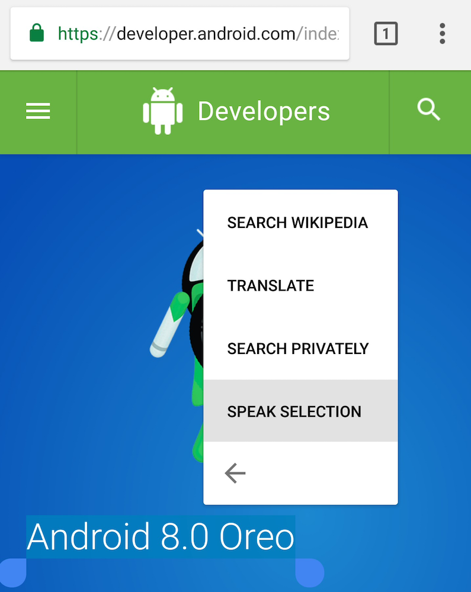
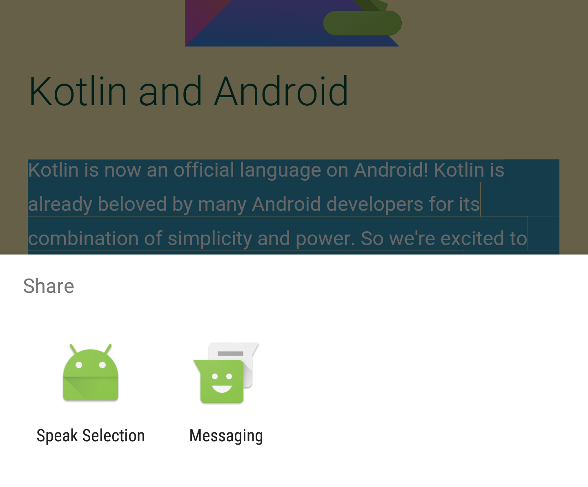
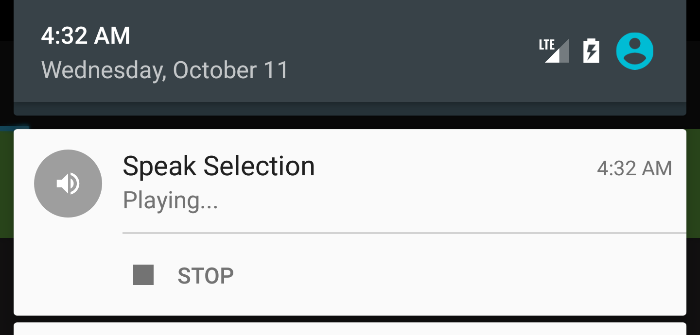

# Speak Selection
Speak Selection is an app for Android that mimics the "Speak Selection" button on iOS.

## Installation
A precompiled APK file can be found in the [release page](https://github.com/derek1906/Speak-Selection/releases).

## Usage
There are multiple ways to trigger the playback:

1. Select text anywhere in the system and choose "Speak Selection".  
    
2. Select text anywhere in the system and choose "Share" > "Speak Selection".  
    
    
Playback can be stopped by pressing "Stop" in the notification:  
    

Make sure to select the correct language before using!

## Tools
Android Studio is recommended to build the project. There are no extra dependencies.

## Requirements
Android 6.0 or above is required for the new intent filter to work.